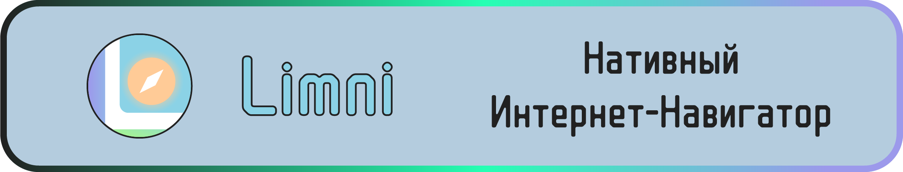

# 

---

[English](https://github.com/FerrisMind/Limni/blob/main/README.md) | [Русский](https://github.com/FerrisMind/Limni/blob/main/README-RU.md) | [Português (BR)](https://github.com/FerrisMind/Limni/blob/main/README-PT-BR.md)

---

Современное десктопное приложение для исследования интернета, построенное на Tauri v2 и Svelte 5, с **нативными WebView** вместо iframes.

## ⚡ Ключевые особенности

### 🚀 Нативные WebView

- **Полнофункциональные нативные WebView** вместо iframes для каждой вкладки
- **Высокая производительность** благодаря использованию системных WebView
- **Подлинный пользовательский опыт** с изолированными контекстами для каждой вкладки
- **Безопасность на уровне ОС** с системной песочницей WebView

### 📑 Многовкладочная навигация

- Открытие/закрытие вкладок с автоматическим управлением WebView
- Переключение между вкладками с показом/скрытием соответствующих WebView
- Индикаторы загрузки для каждой вкладки
- Интеллектуальное управление памятью при закрытии вкладок

### 🧭 Веб-навигация

- Кнопки назад/вперед с историей для каждой вкладки
- Адресная строка с автоопределением URL/поиска
- Функция перезагрузки страниц
- История навигации для каждого WebView

### 🔖 Закладки и История

- Локальное хранение закладок
- Полная история посещений с группировкой по датам
- Функция поиска по истории
- Счетчик посещений

### ⚙️ Настройки

- Варианты темы (светлая/темная/системная)
- Настройки безопасности WebView
- Управление домашней страницей
- Выбор поисковой системы

## 🏗️ Архитектура

### Backend (Rust + Tauri v2)

```rust
// Команды для управления WebView
create_tab_webview()  // Создать новый WebView для вкладки
show_tab_webview()    // Показать/скрыть WebView
close_tab_webview()   // Закрыть WebView
navigate_webview()    // Навигация в WebView
resize_webviews()     // Изменить размер WebView
```

### Frontend (Svelte 5)

- **Реактивное управление состоянием** с runes ($state, $derived, $effect)
- **WebViewManager** - управление нативными WebView
- **Асинхронная архитектура** для взаимодействия с Tauri API
- **Современный UI** с CSS-переменными для тем

## 🛠️ Технологический стек

- **Tauri v2** - Кроссплатформенная среда выполнения
- **Svelte 5** - Реактивный фронтенд-фреймворк
- **TypeScript** - Типизированный JavaScript
- **Rust** - Язык программирования бэкенда
- **Native WebView** - Системный WebView (WebView2/WebKit/Blink)

## 🚀 Установка и запуск

### Требования

- **Node.js** 18+
- **Rust** 1.70+
- **Системные зависимости** для Tauri

### Режим разработки

```bash
npm install
cargo tauri dev
```

### Продакшн сборка

```bash
cargo tauri build
```

## 📁 Структура проекта

```
browser/
├── src/                          # Frontend (Svelte)
│   ├── lib/
│   │   ├── components/           # Svelte компоненты
│   │   │   ├── WebViewManager.svelte  # Управление WebView
│   │   │   ├── TabBar.svelte          # Панель вкладок
│   │   │   ├── Toolbar.svelte         # Панель инструментов
│   │   │   └── ...
│   │   ├── stores/              # Управление состоянием
│   │   │   └── browser.svelte.ts
│   │   └── types/               # TypeScript типы
│   │       └── browser.ts
│   └── routes/                  # SvelteKit маршруты
├── src-tauri/                   # Backend (Rust)
│   ├── src/
│   │   └── lib.rs              # WebView команды и логика
│   ├── capabilities/           # Tauri разрешения
│   └── tauri.conf.json        # Конфигурация
└── package.json
```

## 🎯 Возможности

### ✅ Реализовано

- [x] Нативные WebView для каждой вкладки
- [x] Многовкладочная навигация
- [x] Асинхронное взаимодействие с Tauri API
- [x] Система закладок
- [x] История посещений
- [x] Настройки приложения
- [x] Адресная строка с поиском
- [x] Поддержка тем

### 🔄 Планы развития

- [ ] Синхронизация данных между устройствами
- [ ] Расширения и плагины
- [ ] Продвинутые настройки безопасности
- [ ] Импорт/экспорт данных
- [ ] Горячие клавиши
- [ ] Контекстные меню

## 🤝 Участие в разработке

1. Сделайте форк репозитория
2. Создайте ветку для новой функции (`git checkout -b feature/amazing-feature`)
3. Зафиксируйте изменения (`git commit -m 'Add amazing feature'`)
4. Отправьте в ветку (`git push origin feature/amazing-feature`)
5. Откройте Pull Request

## 📄 Лицензия

Этот проект лицензирован под Limni Attribution License (LAL). См. файл [`LICENSE`](https://github.com/FerrisMind/Limni/blob/main/LICENSE) для подробностей.

## 🙏 Благодарности

- **Команде Tauri** за потрясающий фреймворк — [https://tauri.app](https://tauri.app/)
- **Команде Svelte** за реактивный фронтенд-фреймворк — [https://svelte.dev](https://svelte.dev/)
- **Rust сообществу** за надежный язык программирования — [https://www.rust-lang.org](https://www.rust-lang.org/)

---

**Limni** - Демонстрация силы нативных WebView в современных десктопных приложениях! 🚀

**Создано [FerrisMind](https://github.com/FerrisMind)**
